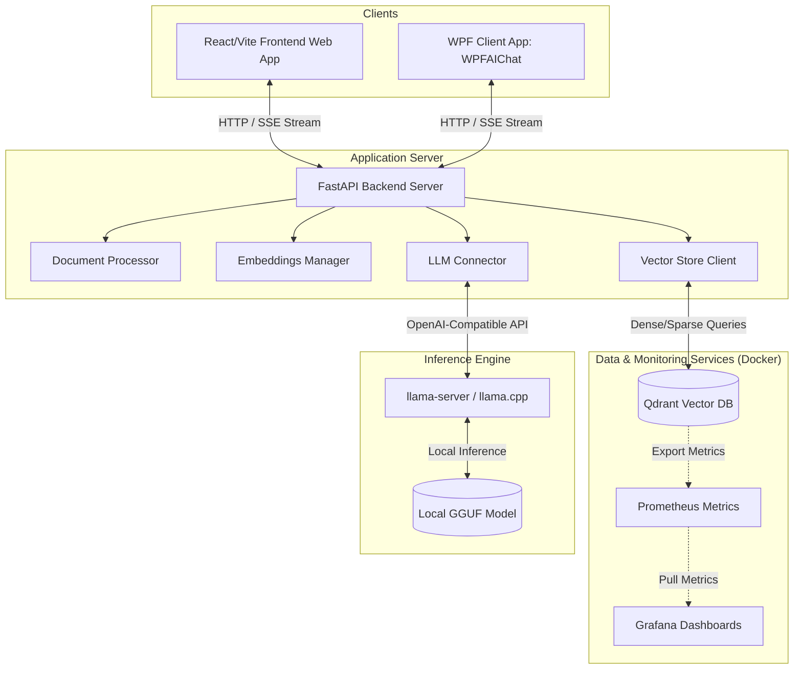
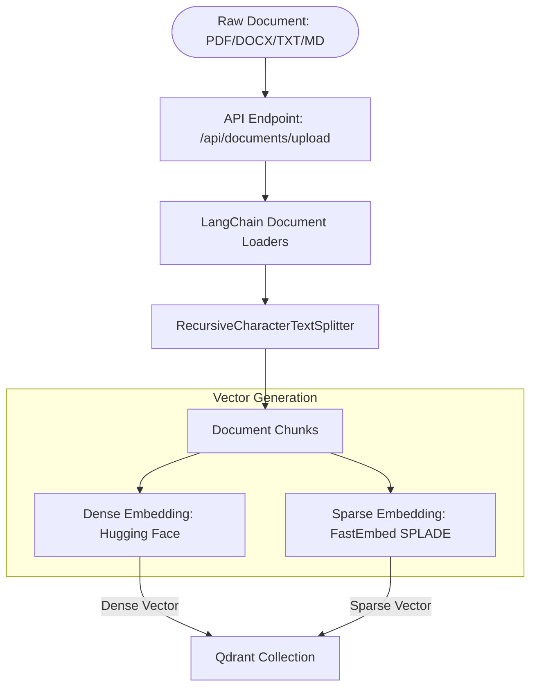
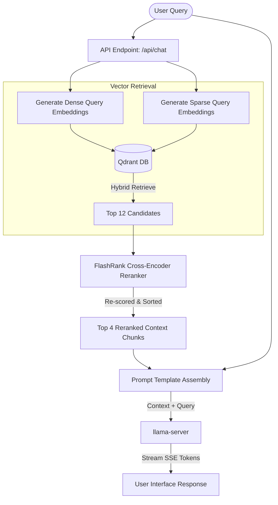

# hoboLocalLLM
Right now, most of the stuff I wrote is mainly for Windows.
A fully local AI chatbot pipeline with a fully local RAG (Retrieval-Augmented Generation) system.

No cloud services. No API subscriptions. No data leaves your machine.

The only recurring cost is electricity.

Use case: Deploy a local private chatbot that answers questions using documents stored in your local vector database. All documents remain within your network and are never sent to or hosted by third-party services. If the retrieved information is insufficient to answer a question, the chatbot responds with "I don't know."

Some random ideas for future exploration: 
+ Training the model to have a "persona" so that no system instruction is needeed
+ Training the model on the documentation directly

## Features

- 100% local inference using `llama.cpp`
- 100% local document indexing and retrieval
- No OpenAI, Anthropic, Google, or other API dependencies
- OpenAI-compatible local endpoint
- Simple document upload workflow
- Works offline after initial setup
- Supports custom GGUF models
- Designed for small businesses, homelabs, and privacy-focused users

---

## Architecture

### 1. High-Level Subsystem Architecture
Both clients (WPF and React Web UI) communicate exclusively with the FastAPI Backend Server (on port 8000). The backend server handles document loading, indexing, vector searching, and queries the local LLM running via `llama-server` (on port 8080).



> [!NOTE]
> There is no direct connection/network path between the Clients and the Inference Engine. All traffic, prompt context compilation, and Server-Sent Events (SSE) streaming flow through the FastAPI backend server to ensure safety and orchestration.

### 2. Document Ingestion Pipeline
When a user uploads a document, the system splits, embeds, and indexes it into the local database:



- **Loaders**: Converts PDF, DOCX, TXT, and Markdown files into raw text chunks.
- **Splitters**: Recursively splits chunks with overlaps to maintain passage coherence.
- **Hybrid Embeddings**: Generates both a **Dense Vector** (for semantic concept search) and a **Sparse Vector** (for exact keyword/lexical search) and writes them to the local Qdrant collection.

### 3. Retrieval & Generation Pipeline (RAG Flow)
When a user submits a query, the system retrieves context, reranks the best matches, compiles a prompt, and streams the answer from the local LLM:



- **Hybrid Search**: Dense & sparse retrieval are executed against the Qdrant DB. 12 candidates are retrieved.
- **FlashRank Cross-Encoder**: Reranks base candidates based on exact semantic relevance to the query, filtering it down to the top 4 chunks.
- **Context Generation**: Assembles the prompt context and sends it to the local `llama-server`. The response is streamed token-by-token using SSE (Server-Sent Events) back to the UI.

No internet connection is required after setup.

---

# Installing `llama.cpp` with Conda

This project uses `llama.cpp` as the inference engine.

Using a dedicated Conda environment helps isolate dependencies and keeps your local LLM setup organized.

## Prerequisites

Install one of the following:

- Anaconda
- Miniconda (recommended)

Verify Conda is installed:

```bash
conda --version
```

Example output:

```text
conda 25.x.x
```

---

## Step 1: Create a Dedicated Environment

Create a new environment:

```bash
conda create -n LocalLLM python=3.11 -y
```

Activate it:

```bash
conda activate LocalLLM
```

Verify the environment:

```bash
conda info --envs
```

The active environment will be marked with `*`.

---

## Step 2: Add the Conda-Forge Repository

`llama.cpp` is distributed through Conda-Forge.

Add the repository:

```bash
conda config --add channels conda-forge
```

Enable strict channel priority:

```bash
conda config --set channel_priority strict
```

This helps prevent dependency conflicts.

---

## Step 3: Install `llama.cpp`

Install the package:

```bash
conda install llama.cpp
```

Conda will automatically install all required dependencies.

---

## Step 4: Verify Installation

Verify the installation completed successfully:

```bash
llama-server --help
```

or

```bash
llama-cli --help
```

You should see a list of available command-line options.

You can also verify the package directly:

```bash
conda list llama.cpp
```

---

## Included Utilities

Depending on the installed version, the Conda package may include:

| Tool | Purpose |
|--------|---------|
| `llama-server` | OpenAI-compatible API server |
| `llama-cli` | Command-line inference |
| `llama-quantize` | Model quantization |
| `llama-bench` | Performance benchmarking |
| `llama-perplexity` | Perplexity testing |
| `llama-batched` | Batch inference examples |

---

## Step 5: Download a Model

Download a GGUF model from a model repository.

Recommended starter models:

- Phi-4 Mini Instruct
- Qwen 3
- Gemma 3
- Llama 3.2

Create a model directory:

### Windows

```text
C:\LLMModels\
```

### Linux/macOS

```text
~/LLMModels/
```

Place your downloaded `.gguf` files in this directory.

---

## Step 6: Launch the Local API Server

Example:

```bash
llama-server \
  -m "/path/to/model.gguf" \
  -c 8192 \
  --host 0.0.0.0 \
  --port 8080
```

### Command Parameters

| Parameter | Description |
|------------|------------|
| `-m` | Path to the GGUF model |
| `-c` | Context window size |
| `--host` | Network interface to bind to |
| `--port` | API server port |

After startup, the API will be available locally:

```text
http://localhost:8080
```
There's a web UI that's similar to chatgpt at http://localhost:8080/

The endpoint is compatible with:

- C#
- Python
- JavaScript
- LangChain
- LlamaIndex
- Open WebUI
- Custom RAG applications

---

## Included Scripts — `LocalLLM/`

The `LocalLLM` folder contains two scripts.

### `install.ps1` — One-time setup

Run this once to install Conda, create the `LocalLLM` environment, and install `llama.cpp`:

```powershell
cd LocalLLM
.\install.ps1
```

This script will:
- Verify that Conda is available in your PATH.
- Create (or reuse) the `LocalLLM` Conda environment with Python 3.11.
- Add the `conda-forge` channel and install `llama.cpp`.
- Verify the installation by running `llama-server --version`.

### `startLocalLLM.ps1` — Launch the server

After installing, edit the model path inside the script, then run it:

```powershell
.\startLocalLLM.ps1
```

This script:
- Activates the `LocalLLM` Conda environment.
- Starts `llama-server` with sensible defaults (8192 context, full GPU offload).
- Exposes an OpenAI-compatible API on `http://localhost:8080`.

> **Before running**: Download a GGUF model. We recommend starting with Microsoft's **Phi-4 Mini Instruct (Q8_0)**:
> - **[Direct Download: Phi-4-mini-instruct.Q8_0.gguf (4.3 GB)](https://huggingface.co/unsloth/Phi-4-mini-instruct-GGUF/resolve/main/Phi-4-mini-instruct.Q8_0.gguf?download=true)**
>
> Save the downloaded file to `C:\LLMModels\` and update the `-m` path in `startLocalLLM.ps1`.

---

## Project Roadmap

### Phase 1 - Local Inference
- [x] llama.cpp setup
- [x] Local API endpoint

### Phase 2 - Local RAG
- [x] Automatic document ingestion (using LangChain loaders)
- [x] Hybrid Chunking pipeline (Recursive Character Splitting)
- [x] Local embedding generation (Dense + FastEmbed Sparse)
- [x] Vector storage (Qdrant)
- [x] Semantic & Lexical Hybrid search (Dense + Sparse/BM25)
- [x] Contextual Reranking (FlashRank Cross-Encoder)

### Phase 3 - User Experience
- [x] Web UI
- [x] Drag-and-drop document uploads
- [ ] Chat history
- [x] Source citations with score ratings
- [x] A test benchmark evaluation suite for the RAG pipeline and local models

### Phase 4 - Production
- [ ] Multi-user support - The end goal with be to switch to using either SGLang or vLLM (vLLM better for use case). However, these two llm serving framework doesn't support AMD GPU on Windows so can't mess around with it yet.
- [ ] Authentication
- [x] Docker deployment - kinda
- [ ] Monitoring

---

## 📂 Local RAG Subsystem

A fully local, premium-designed RAG (Retrieval-Augmented Generation) dashboard with Qdrant, FastAPI, and React/Vite is available in the [LocalRAG](./LocalRAG) folder.

### Quick Start Instructions:

1. **Install all dependencies**:
   Run the automated PowerShell installer:
   ```powershell
   cd LocalRAG
   .\install.ps1
   ```
2. **Start the local LLM**:
   Launch `llama-server` with embedding support enabled (e.g., using `.\startLocalLLM.ps1` in the `LocalLLM` folder).
3. **Launch the RAG subsystem & database**:
   Run the startup orchestrator. This will automatically check and start the Docker Compose stack (Qdrant, Prometheus, and Grafana), launch the backend, and open the React dashboard:
   ```powershell
   .\start_rag.ps1
   ```

For detailed guides, component diagrams, and RAG tuning options, please check the [LocalRAG README](./LocalRAG/README.md).

---

## 🖥️ WPF Desktop Client

A native Windows desktop chat and configuration client built in C# / WPF (.NET 9) is available in the [WPFAIChat](./WPFAIChat) folder.

### Quick Start Instructions:
1. Ensure the LocalRAG backend server is running (`.\start_rag.ps1` in `LocalRAG/`).
2. Run the desktop application from the CLI:
   ```powershell
   cd WPFAIChat
   dotnet run
   ```

For advanced features and code structure, see the [WPFAIChat README](./WPFAIChat/README.md).

---

## Troubleshooting

### Conda Command Not Found

Ensure Conda is installed and available in your system PATH.

### Package Not Found

Update Conda:

```bash
conda update -n base -c defaults conda
```

Then retry the installation.

### Wrong Environment Active

Verify:

```bash
conda activate LocalLLM
```

### GPU Not Being Used

Check:

- NVIDIA drivers are installed
- CUDA-compatible build is available
- Your model launch configuration includes GPU offloading settings

---

## Goal of This Project

The goal of hoboLocalLLM is to make local AI accessible to anyone.

The intended user experience is simple:

1. Start the model.
2. Upload documents.
3. Ask questions.
4. Receive answers.

No cloud infrastructure.
No API keys.
No subscriptions.
No vendor lock-in.

Just a local AI assistant that runs entirely on your own hardware.
